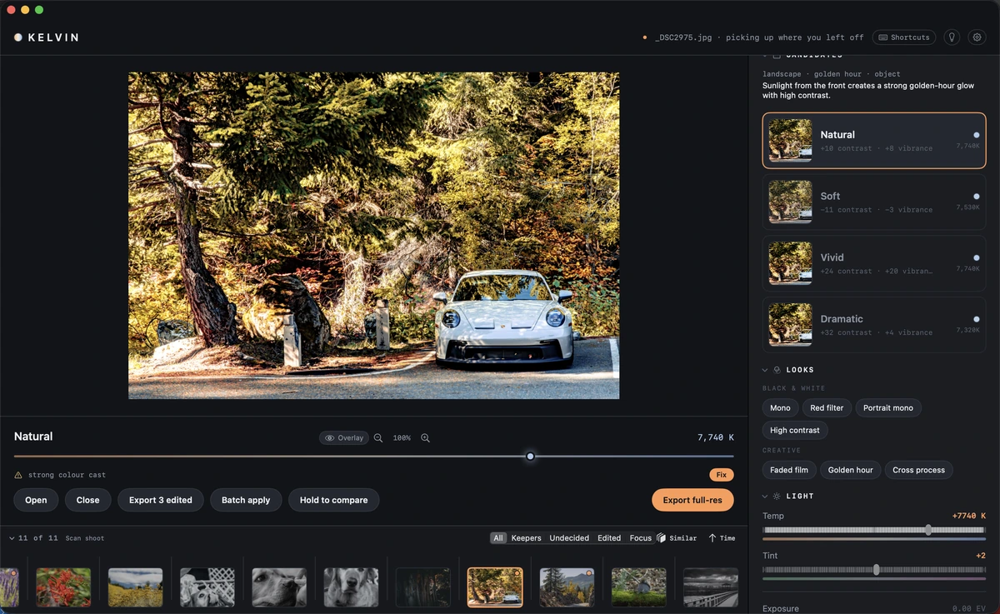
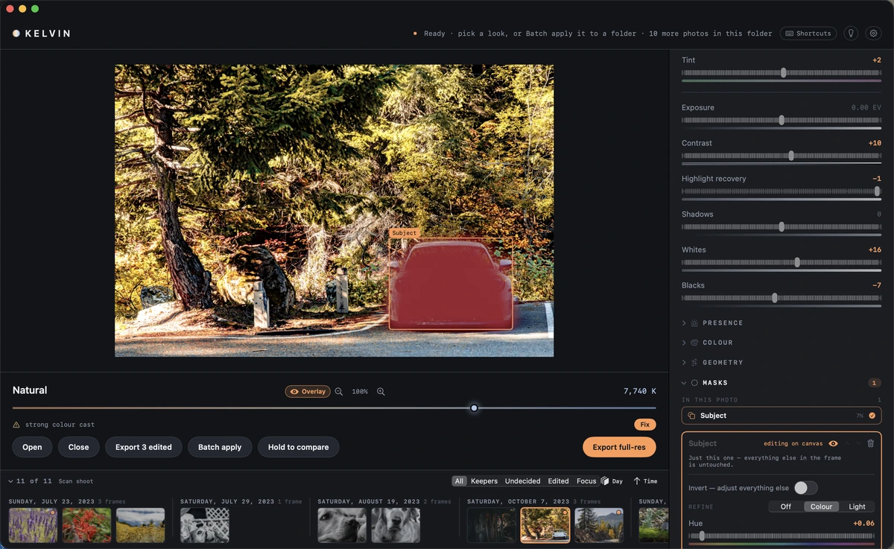

<div align="center">


# Kelvin

**A local-AI photo editor for macOS.**

A small vision model reads your photograph. Deterministic code writes the edit.<br>
Everything runs on your machine — your photographs never leave it.

[](https://github.com/wmwallace/Kelvin/actions/workflows/ci.yml)
[](LICENSE)
[](#running-it)
[](Package.swift)
[](https://github.com/sponsors/wmwallace)

</div>

---

Drop in a photo. Kelvin reads the scene and hands you three or four finished
edits to choose between. Pick one, tune it, apply it across the shoot.

<p align="center">

</p>
<p align="center"><sub>One frame, four candidate edits. Not four filters over the same numbers — four readings of the
photograph, each computed from its own histogram and EXIF.</sub></p>

## Why

Most tools give you one answer, or ask you to teach them your style with thousands of past edits
first, or repaint your pixels with a generative model.

Kelvin reads one photograph and offers a few defensible interpretations of it. You pick. That choice
is the point of the whole app.

The idea underneath: **the model never chooses numbers.** It answers categorical questions — what
kind of scene, what the light is doing, what's technically wrong. Every actual value is then computed
by ordinary, tested code from the histogram and the EXIF. Ask a small model for `exposure: +0.37` and
it will invent one, confidently, and you will never know which answers were guesses.

## Status: pre-alpha

**Works today**

- The full editor: the adjustment set, colour mixer and geometry, with a mask kit — subject, sky,
  radial, graduated, brush, colour range, luminance, skin, per-person
- On-device scene reading, shown in the panel so you can see what it made of the photograph
- Candidate generation: three or four finished edits per photograph
- Culling: keep/reject, a filmstrip that groups a shoot by burst, day, place or near-duplicate, and
  a scan that marks the sharpest frame of each burst
- Batch apply across a folder, and exporting every photo you edited in one go — JPEG, HEIC, PNG or
  16-bit TIFF, at full size or a chosen long edge, in sRGB, Display P3 or Adobe RGB
- Non-destructive throughout: your originals are never written to

**Not yet**

- No public release build
- Preference learning exists in the engine but isn't wired into a loop
- Auto-masks can be refined and inverted, but not brushed by hand
- Nothing generative, on purpose

479 tests — 390 over the core, 89 over the app. CI runs on every pull request.

<p align="center">

</p>
<p align="center"><sub>The scene reading is shown rather than hidden — "landscape · golden hour · object", and a
sentence explaining what it saw. If it read the photograph wrongly, you can tell at a glance.</sub></p>

<p align="center">

</p>
<p align="center"><sub>A shoot grouped by capture day. It also groups by burst, by place, or by near-duplicate — and
under burst or near-duplicate it marks the sharpest frame of each run.</sub></p>

## Running it

macOS 14+, Xcode 16.3+.

```sh
xcodebuild -downloadComponent MetalToolchain   # once — Xcode doesn't install this by default
make build && make test
make app
```

The first run downloads about 1.6 GB of model weights. Released builds include them instead — see
[It runs on your Mac](#it-runs-on-your-mac). [`CONTRIBUTING.md`](CONTRIBUTING.md) has the details and the gotchas.

Opens RAW, JPEG, HEIC, PNG and TIFF.

## It runs on your Mac

The editing and the scene reading both happen locally. There's no account, no upload and no
telemetry, because there's no server to talk to. If your library already lives in iCloud then it
lives in iCloud — that's your setup, and Kelvin neither adds to it nor takes it away.

A released build carries the model inside it and needs no network to work. Built from source, it
fetches the weights once, at a pinned revision.

Your originals are never modified: edits are kept in Kelvin's own folder, never beside your
files. Exports carry the original metadata by default,
**including location** — there's a switch in the export panel to strip it, with tests that read the
file back to check.

## Built with

Swift 6 and SwiftUI. Core Image for RAW decoding, so camera profiles come from Apple. MLX for
on-device inference with a 4-bit vision model. Edits are stored as small JSON recipes.

Mac-only is a choice, not an oversight — see [`docs/DECISIONS.md`](docs/DECISIONS.md).

## Documentation

| | |
|---|---|
| [CONTRIBUTING](CONTRIBUTING.md) | Before your first build or patch |
| [docs/ARCHITECTURE](docs/ARCHITECTURE.md) | How the pipeline fits together |
| [docs/RECIPE-SCHEMA](docs/RECIPE-SCHEMA.md) | The data model |
| [docs/DECISIONS](docs/DECISIONS.md) | Why things are the way they are — read before proposing changes |
| [docs/EVALUATION](docs/EVALUATION.md) | How edit quality is measured |
| [docs/RELEASING](docs/RELEASING.md) | Building a signed, notarised release |

## Contributing and support

Bug reports and reproductions are welcome and carry no licensing question. For patches, see
[CONTRIBUTING.md](CONTRIBUTING.md).

If Kelvin earns a place in your workflow, you can [sponsor its development](https://github.com/sponsors/wmwallace).
Sponsors are thanked by name inside the app — the list ships in each release, because Kelvin
doesn't phone home, not even for a thank-you.

Kelvin is written by its owner working with Claude, and the commit history says so. That history is
kept rather than squashed — it records what was measured and why decisions went the way they did.

## Licence

[AGPL-3.0-only](LICENSE). If you build on this and ship it — as an app or as a service — your source
has to be open too.

Contributions are covered by a [contributor licence agreement](CLA.md): you keep your copyright, and
the maintainer keeps the ability to relicense. Reasoning in `docs/DECISIONS.md` (D8).

Copyright © 2026 William Wallace.
